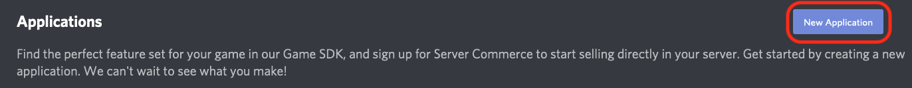
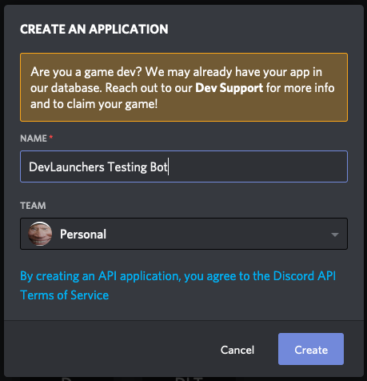
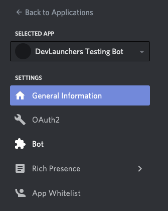
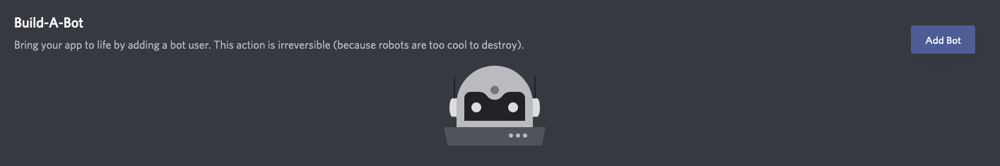
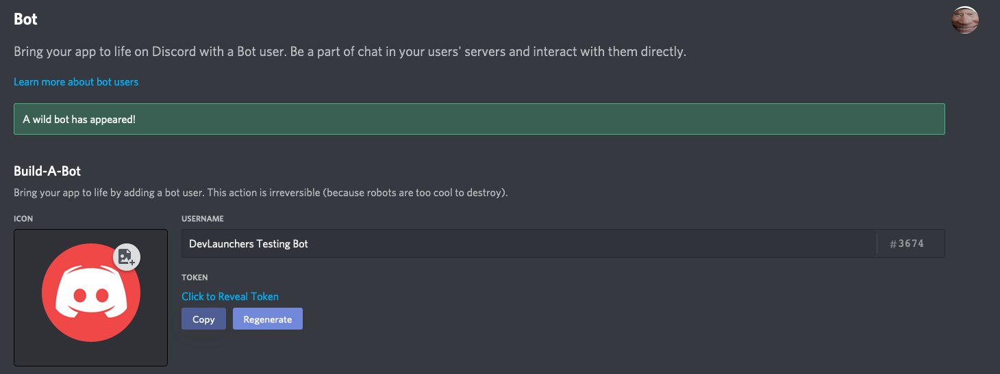

# DevLaunchers Discord Bot

## What is this repository about?

This repository hosts the code for our _open-source, community-driven_ Discord Bot.

## Setup

### Pre-requisites

-   Make sure you have [Node.js](https://http://nodejs.org/) installed
-   Create a [Discord](https://discord.com) account if you haven't already.
-   Make sure you have a **Git Client**.

Once you have setup pre-requisites, follow these 6 simple steps in order:

1. Install all the packages for the bot with `npm install` in a terminal.
2. Create a new **Discord Bot Application**:

    - Visit [Discord's Developer Portal](https://discord.com/developers/applications/me) with a web-browser.

        - Click on the "New Application" button.
        - 

        - Enter "DevLaunchers Testing Bot" or whatever name you want, and then click "Create".
        - 

        - Navigate to the "Bot" tab in the sidebar.
        - 

        - Create a new Bot by clicking "Add Bot", and then confirm.
        - 

        - Copy your brand new bot's token, you'll need this for the next step.
        - **IMPORTANT: Do not share this token with anyone but official DevLaunchers Bot Contributors. They will have the _"Bot Contributor"_ role in our Discord Server.**
        - 

3. Fill out `.env.example` with the token you just copied.
    - 3.5 Rename `.env.example` to `.env`.
4. Add a new line to `.gitignore`:

```gitignore
node_modules
json.sqlite
# append
.env
```

5. In a terminal, run `npm run dev-start` for speedy changes (no metrics, make sure you know what you're doing), or `npm run start` for general testing.
6. Congratulations! You now have your very own instance of the DevLaunchers Discord Bot!
    - 6.1 **NOTE:** All of your changes are applied automatically. The bot is ready when it logs so in the terminal.

## Contributing

Please refer to [our contributors guide](CONTRIBUTING.md).

## License

This repository is licensed under the [MIT License](https://choosealicense.com/licenses/mit/).
